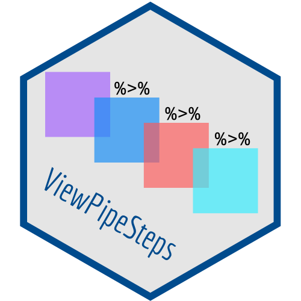
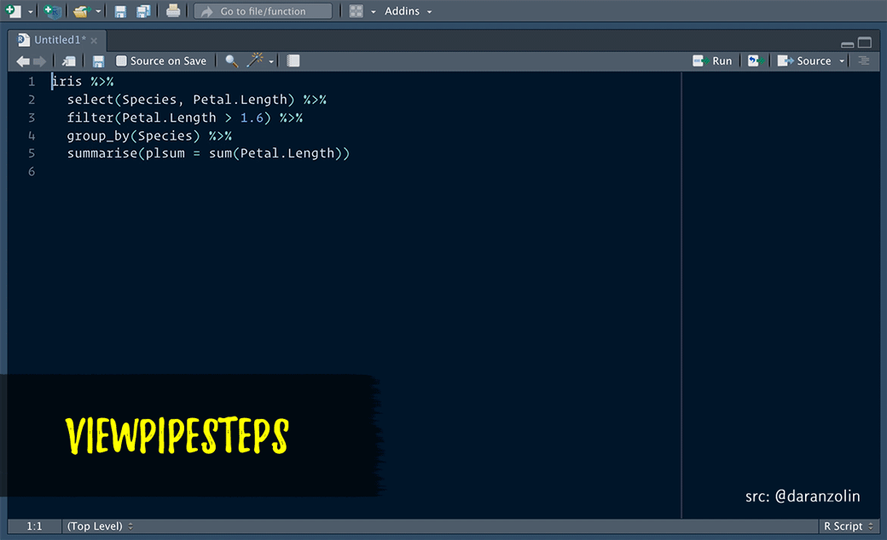

``` {r, include = FALSE}
library(tidyverse)
library(ViewPipeSteps)
```

# ViewPipeSteps 


## Overview

ViewPipeSteps helps to debug pipe chains in a *slightly* more elegant fashion. Print/View debugging isn't sexy, but instead of manually inserting `%>% View()` after each step, spice it up a bit by, e.g., highlighting the entire chain and calling the `viewPipeChain` addin:



Thanks to @batpigandme for the the gif!

Alternatively, you can:

- Print each pipe step of the selction to the console by using the
  `printPipeChain` addin. 
- Print all pipe steps to the console by adding a print_pipe_steps() 
  call to your pipe.
  
``` {r}
diamonds %>%
  select(carat, cut, color, clarity, price) %>%
  group_by(color) %>%
  summarise(n = n(), price = mean(price)) %>%
  arrange(desc(color)) %>%
  print_pipe_steps() -> result
```

- Try your luck with the experimental `%P>%` pipe variant that prints the output
  of the pipe's left hand side prior to piping it to the right hand side.

``` {r}
diamonds %>%
  select(carat, cut, color, clarity, price) %>%
  group_by(color) %>%
  summarise(n = n(), price = mean(price)) %P>%
  arrange(desc(color)) -> result
```

## Installation

```
devtools::install_github("daranzolin/ViewPipeSteps")

```
## More Examples

Check [tools/test_cases.R for more elaborate examples.](https://github.com/joachim-gassen/ViewPipeSteps/blob/master/tools/test_cases.R) 


## Future Work

* Verify that %P>% is implemented in a useful way and does it what it
  is supposed to do.


